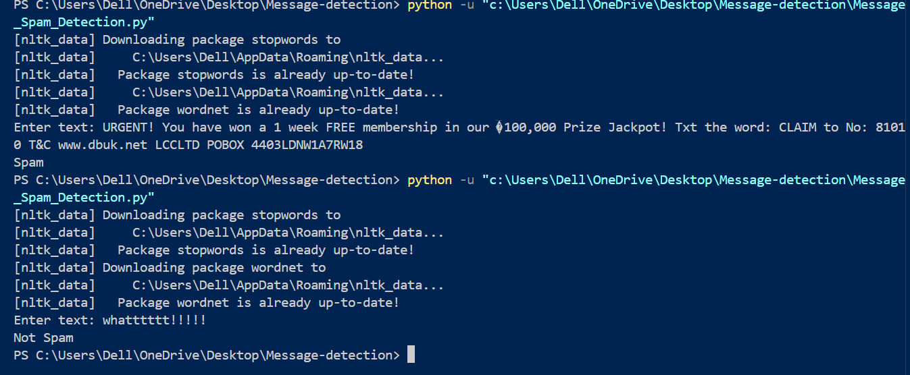

# 📦 Python Project Submission: Message Detection

## 📝 Submitted To:

- **Instructor**: Dr. Prateek Raj Gautam  

## 🙋‍♂️ Submitted By:

- **Name**: ANURAG KUMAR SINGH  
- **SAP ID**: 590018370  

---

## 📌 Project Title: Message Detection

### 🔍 Description:
This project implements a **Message Spam Detection** system using machine learning techniques. The system classifies messages as **spam** or **not spam** based on their content. 

Key features of the project include:
- **Text Preprocessing**: Tokenization, stopword removal, lemmatization, and vectorization.
- **Feature Extraction**: Bag of Words (Count Vectorizer) and TF-IDF Transformation.
- **Model Training**: A **Random Forest Classifier** is trained on a labeled dataset to make predictions.
- **User Interaction**: The script accepts user input and predicts if the message is spam or not.

The dataset used in this project is sourced from Kaggle (details provided within the code). Screenshots for the output and dataset are also included for reference.

---

## ⚙️ Installation

Clone the repository:  
```

Clone the repository:  
```bash
git clone "https://github.com/anurag815311/Message-detection.git"
```

### Required Libraries:
Install the dependencies using pip:
```bash
pip install pandas nltk scikit-learn
```

---

## 🛠️ Setup Instructions

1. **Clone the Repository**: Use the command above to clone the repository to your local machine.
2. **Download Dataset**: Ensure the dataset file is available in the specified path in the script.
3. **Run the Code**:
   - Open the script in your preferred editor or notebook.
   - Execute all cells or run the script to train the model and test predictions.

---

## 🚀 Usage

1. Run the Python script.
2. Enter a text message when prompted.
3. View the output classification:
   - "Spam" for spam messages.
   - "Not Spam" for legitimate messages.

---

## 🖼️ Screenshots

### Output Screenshot:



---

## 📚 Libraries Used

- **pandas**: For data manipulation and analysis.
- **nltk**: For natural language processing, including stopword removal and lemmatization.
- **sklearn**: For machine learning tasks like vectorization, TF-IDF transformation, and classification.
- **pickle**: (Optional) For model serialization and saving trained models.

---


## ✨ Acknowledgments

- **Kaggle Dataset**: The dataset used for spam classification.
- **Python and Libraries**: The amazing Python community and the open-source tools used in this project.

